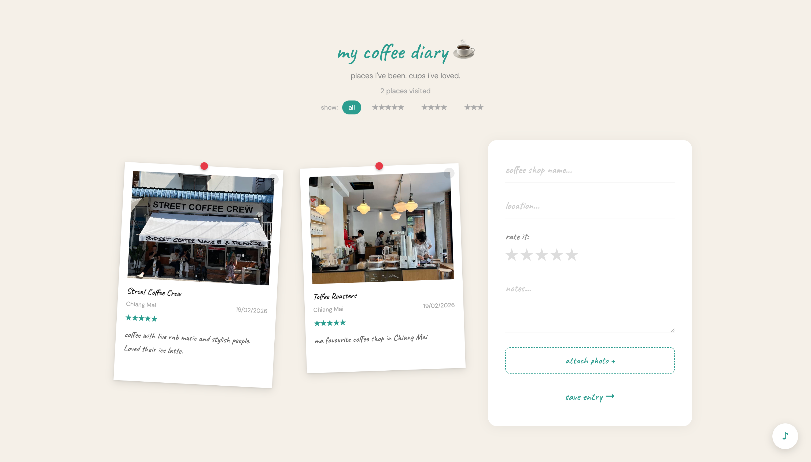

# my coffee diary

A personal app to log every coffee shop I visit. Polaroid-style cards, photo attachments, star ratings, and a cosy jazz player in the corner. Everything saves in your browser with no account needed.

**Stack:** `React · TypeScript · Vite · Tailwind CSS · Framer Motion · Web Audio API · localStorage`

---

## Why I built this

This was my first real project. I had just started learning to code and wanted to build something I would actually use. Coffee shops are where I work, so logging them felt natural. The goal was to touch as many fundamentals as possible in one small app: forms, state, file uploads, local persistence, animations, sound.

## What it does

- Log coffee shops with name, location, rating, and notes
- Attach a photo to each entry
- Entries display as polaroid cards with a pin
- Filter entries by star rating
- Cosy jazz music player while you browse
- All data saved in localStorage, no account or backendd

## Preview

## What I learned building this

- Project structure and CLAUDE.md workflow
- Controlled forms and state management in React
- localStorage for persistent data without a backend
- File upload with FileReader and base64 image encoding
- Web Audio API for the shutter sound effect
- Component architecture: props, callbacks, lifting state
- CSS design system with custom variables
- Tailwind utility classes and Framer Motion animations

## Run locally

    npm install
    npm run dev

Open http://localhost:5173

---

Part of a series of projects built to go from zero coding knowledge to full-stack developer. Each project introduces one new concept.

## GitHub Topics

`react` `typescript` `vite` `tailwind` `framer-motion` `localstorage` `learning` `beginner` `coffee`
